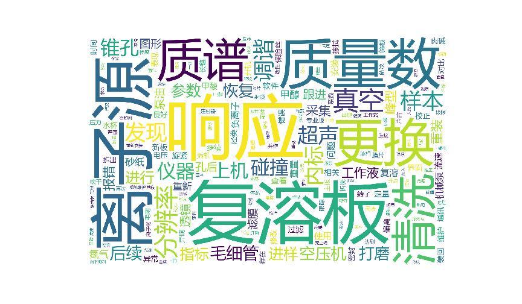

```python
import pandas as pd
import numpy as np

import warnings
def ignore_warn(*args, **kwargs):
    pass
warnings.warn = ignore_warn
warnings.simplefilter('ignore')

import matplotlib.pyplot as plt
import seaborn as sns

from pylab import *
mpl.rcParams['font.sans-serif'] = ['SimHei']
plt.rcParams['axes.unicode_minus'] = False

% matplotlib inline

from wordcloud import WordCloud
import jieba
from jieba import analyse
import re

data = pd.read_excel('../data/2015-2018维修数据_部分.xlsx')

def text_clean(content):
    try:
        result = re.sub(r'[^\u4e00-\u9fa5,A-Za-z0-9]', " ",content)
        result = re.sub('br', " ",result)
        result = re.sub('nbsp', " ",result)
        result = re.sub('正常', " ",result)
    except:
        result = ''

    return result

data['word_clean'] = data['服务报告'].apply(lambda x: text_clean(x))

def word_cloud_tfidf(data_line):

    cache = ""

    for i in data_line:
        cache = cache + i
    content = " ".join(jieba.cut(cache))

    key_words = analyse.extract_tags(content, topK=2000, withWeight=True, allowPOS=('nb','n','nr', 'ns','a','ad','an','nt','nz','v','d'))
    textrank = analyse.textrank(content,topK = 200,withWeight = True)

    keywords = dict()
    for i in key_words:
        keywords[i[0]] = i[1]
        
#     back_coloring = plt.imread(bg_image_path)  # 设置背景图片

    my_wordcloud = WordCloud(
                     background_color = 'white', #背景颜色
                     width=1500,height=960, #图片大小
                     margin=10
                   )
    my_wordcloud.generate_from_frequencies(keywords)

    plt.figure(figsize = (12, 7))
    plt.imshow(my_wordcloud)
    plt.axis("off")
    plt.show()

def word_cloud(data_line):

    text = " "

    for i in data_line:
        text = text + i

    wordlist_after_jieba = jieba.cut(text, cut_all = True)
    wl_space_split = " ".join(wordlist_after_jieba)

    my_wordcloud = WordCloud().generate(wl_space_split)
    plt.figure(figsize = (12, 7))
    plt.imshow(my_wordcloud)
    plt.axis("off")
    plt.show()
```

```python
for en in data['分配工程师'].unique():
    print(en)
    if (data['分配工程师'] == en).sum()> 10:
        word_cloud_tfidf(data.loc[data['分配工程师'] == en, 'word_clean'], en)
    else:
        print('数据量太少...')
```



