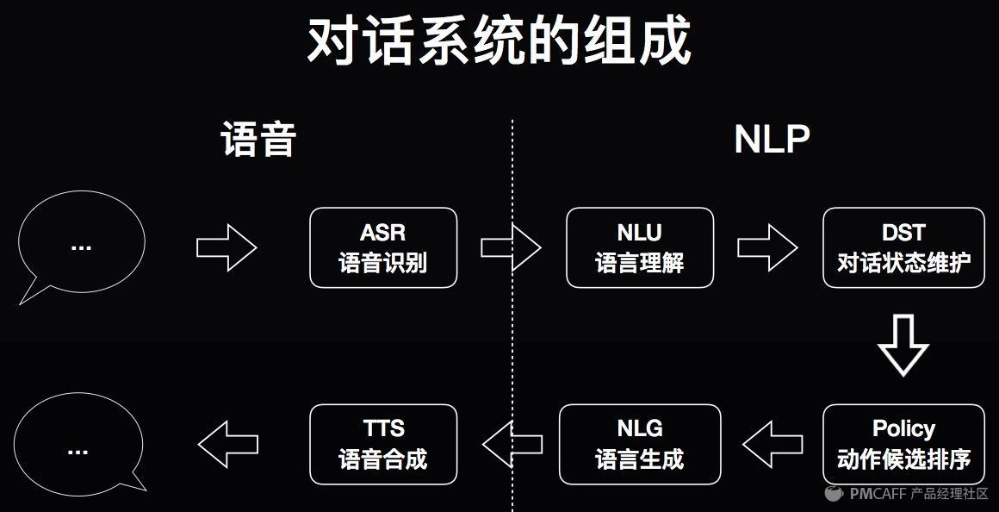
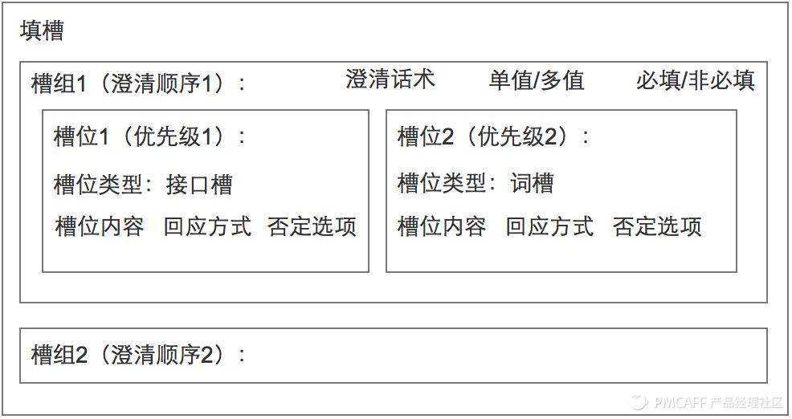
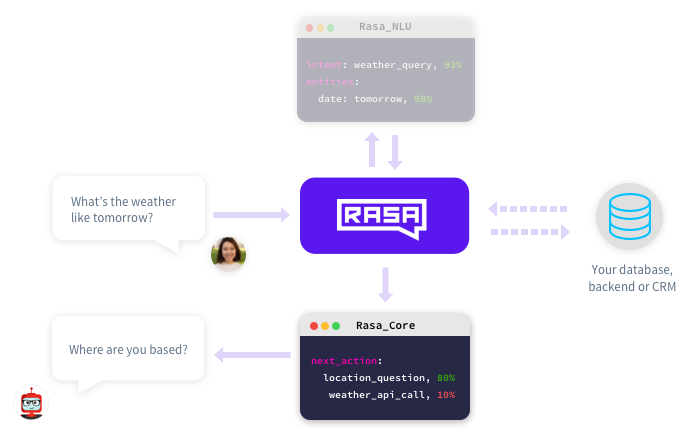

# 聊天机器人知识整理


聊天机器人整体来说还是很难的事


## 对话系统

自然语言识别的技术限制，用户期望的不正确设定使得很多机器人被淘汰

机器人能做的都还基本处于在第一阶段——**服务**。

解析技术已经不再构成对话机器人产品的核心竞争力

识别用户意图之后所提供的服务开始成为对话机器人产品差异化的核心


技术革新，变的不是人们的需求，而是人们需求被满足的方式。

只有用户选择用你的产品来满足需求，那你所谓的技术革新才有意义。





识别用户意图之后所提供的服务就是上图中的 DST（对话状态维护）以及 Policy（动作候选排序），或者统一的称其为 DM（Dialogue Mannagement，对话管理）

当接收到 NLU 模块的输出、其他场景及用户特征信息之后，判断系统应该跳转到什么状态，以及执行什么样的动作。

### 

### 任务型对话

为了解决任务而进行的对话，比如你让Siri帮你定闹钟、发短信等


DM 是对话机器人**封闭域多轮对话**体验的核心，正是一次次 DST + Policy 形成了人机间的多轮对话体验。

- 封闭域多轮对话：识别用户意图之后，为了获取必要信息，与用户进行的有目的的多轮对话。

  > 必要信息不一定来自于对话获取。
  >
  > 更多信息来源于说话人的身份、当前的时间/地点等一系列场景信息。所以多轮对话的信息获取方式，也不应当只局限于用户所说的话。
  >
  > 如果用户的话语中已经提供了充足的信息，或者其它来源的补充信息已足够将用户的初步意图转化为一条明确的用户指令，那就不会存在与用户的多次对话交互

- 开放域多轮对话：识别用户意图之前，为了利用上文信息，所采用的『上下文替换』、『主体补全』等技术


#### 填槽

多轮对话的目的是将**初步用户意图**转化为**明确用户指令**



槽：多轮对话过程中将**初步用户意图**转化为**明确用户指令**所需要补全的**信息**。一个槽与**一件事情**的处理中所需要获取的**一种信息**相对应。

一个完备的多轮对话体系应当同时具备从用户**话里**以及**话外**获取信息的能力。

填槽的意义有两个：**作条件分支多轮对话**、**作信息补全用户意图**。换言之，填槽不仅是补全用户意图的方式，而且前序槽位的填写还会起到指导后续信息补全走向的作用。


词槽：利用用户话中关键词填写的槽

接口槽：利用用户画像以及其他场景信息填写的槽

同一个槽，可能会存在多种**填槽方式**。

**槽组**：可能包含多种填槽方式的**槽**

填槽流程：

- 尝试填写词槽
- 若失败，尝试填写第一接口槽『用户日程表中隐含的出发地』
- 若失败，尝试填写第二接口槽『用户当前所在位置』
- 若失败，判断是否该槽必填
- 若必填，反问用户，重填词槽 *若非必填，则针对该槽组的填槽过程结束

澄清话术：**对话机器人希望获取某种信息时所使用的问句**

槽的填写：同义词典、规则、双向LSTM+CRF，各有各的方法。

**用户的意图并不一定包含在接口的全部返回值之中**：**否认选项**意味着**该种信息获取方式未能成功获取信息**

必填槽，非必填槽，平级槽，依赖槽

完整的多轮对话过程通常会以**树**的形式存在，树中包含多个**节点**，代表处理这件事情的**一个步骤**。而每个节点，都应当有其特别的**准入条件**

树的**根节点**往往需要限制 **NLU 模块的输出**，也即明确什么样的用户意图将会由该棵多轮对话树来处理；树的**中间及叶子节点**往往需要根据**前序槽组的填槽结果**以及其他背景信息进行条件限制。


### 非任务型/闲聊型对话

human-to-human的正常聊天：非任务型对话的多轮对话问题


主流架构为”NLU自然语言理解+DM对话管理+NLG自然语言生成”

- **NLU**负责基础自然语言处理，主要目标是**意图识别**与**实体识别**；
- **DM**负责**对话状态维护**、**数据库查询**等；
- **NLG**负责生成**交互的自然语言**。


## 基本流程

chatbot 不是简单地我发一句话，对面回复一句话


### 分流

对于文本、图片、音频分流处理

对于文本，对于大众使用时需要做敏感词检测，人格检测用于大部分问题如：你是谁？

经过分流过滤后的句子才是可以通过算法模型来解决的聊天内容


### NLU部分



针对用户的问题，NLU模块的任务是：

1. 意图识别 (Intent)：在**句子级别**进行分类，明确意图；
2. 实体识别 (Entity)：在**词级别**找出用户问题中的**关键实体**，进行实体槽填充(Slot Filling)。


#### 语料获取和预处理

为了增大覆盖面，我们往往需要收集大量的词汇

把所有分好词的语料文件放在同一个文件路径下


#### 训练词表示

**训练所有词向量特征**，后面的**命名实体模型**和**关系模型**都是建立在它的基础上


#### NLU模型训练

##### 训练数据示例

```json
{
    "text": "这附近哪里有吃麻辣烫的地方",
    "intent": "restaurant_search",
    "entities": [
      {
        "start": 7,
        "end": 10,
        "value": "麻辣烫",
        "entity": "food"
      }
    ]
}
```

- `text`（required）：待处理的句子示例。
- `intent`（optional）：这个句子应该关联的意图。
- `entities`（optional） ：`start`和`end`共同定义实体范围，在上面的例子中， `"text": "这附近哪里有吃麻辣烫的地方"`, 那么 `text[7:10] == '麻辣烫'`。实体还可以扩展到**多个词**, 而且`value`不一定要是你句子中的词，这样一来，就能**将同义词、误拼映射到同一个值上**，比如下面这个例子：

```json
[
  {
    "text": "in the center of NYC",
    "intent": "search",
    "entities": [
      {
        "start": 17,
        "end": 20,
        "value": "New York City",
        "entity": "city"
      }
    ]
  },
  {
    "text": "in the centre of New York City",
    "intent": "search",
    "entities": [
      {
        "start": 17,
        "end": 30,
        "value": "New York City",
        "entity": "city"
      }
    ]
  }
]
```


##### 测试结果示例

```json
$ curl -XPOST localhost:5000/parse -d '{"q":"我发烧了该吃什么药？", "project": "rasa_nlu_test", "model": "model_20170921-170911"}' | python -mjson.tool
  % Total    % Received % Xferd  Average Speed   Time    Time     Time  Current
                                 Dload  Upload   Total   Spent    Left  Speed
100   652    0   552  100   100    157     28  0:00:03  0:00:03 --:--:--   157
{
    "entities": [
        {
            "end": 3,
            "entity": "disease",
            "extractor": "ner_mitie",
            "start": 1,
            "value": "发烧"
        }
    ],
    "intent": {
        "confidence": 0.5397186422631861,
        "name": "medical"
    },
    "intent_ranking": [
        {
            "confidence": 0.5397186422631861,
            "name": "medical"
        },
        {
            "confidence": 0.16206323981749196,
            "name": "restaurant_search"
        },
        {
            "confidence": 0.1212448457737397,
            "name": "affirm"
        },
        {
            "confidence": 0.10333600028547868,
            "name": "goodbye"
        },
        {
            "confidence": 0.07363727186010374,
            "name": "greet"
        }
    ],
    "text": "我发烧了该吃什么药？"
}
```


### DM部分


1. 外面来的信息首先经由interpreter转成text、intent、entities
2. tracker负责记录对话状态，接收interpreter的结果
3. policy收到当前状态信息
4. policy选择下一步action
5. 所选择的action被tracker记录
6. 输出回复


#### 定义意图和动作：domain.yml

基于`intents`、`entities`和当前对话的内部状态，从`actions`中选择下一步采取的行动


#### 定义解释器（interpreter）：

即上文训练的NLU模型，interpreter用来处理消息，包括执行NLU和把消息转为格式化信息。


#### 训练你的对话模型


## 模型部分


### 检索式模型


从一个备选的大语料库中，用一定的办法去找出里面最匹配的一个或多个回答，直接返回。

通过检索与匹配的方式从已有的大量candidate responses中找出最合适的那个作为response

两种思路

1. 相似度查询
2. 文本匹配，转换成一个二分类问题，能匹配和不能匹配。
   - 编码向量计算匹配度，取出匹配度最高的结果进行返回


#### 模型示例

文本匹配模型，如DSSM、Multi View LSTM、ARC 模型


#### 实现步骤

1. 构建一个由大量query-response pair构成的知识库（比如从豆瓣、贴吧等地方抽取）

2. 将对话中最后一次的回复作为query，通过经典的信息检索方式（倒排索引+TFIDF/BM25）作q-q匹配来召回若干相关的candidate responses。

   > 这一步实在太粗糙了，完全没有考虑语义，所以直接使用检索分数来挑选最优response显然是太过简单粗暴不靠谱。
   >
   > 所以我们还需要使用考虑语义的深度文本匹配模型来将历史对话与这些检索出来的candidate responses进行matching/reranking，从而挑选出一个更加合适的response.


##### 文本深度匹配

直接把复述识别/自然语言推理/检索式问答这些相关领域的文本匹配模型直接拿来用会导致只建模单轮对话，机器人会变成只有7秒记忆的金鱼


##### 多轮对话问题

怎么才能从单轮q-r的匹配扩展到多轮呢？一个最最最简单的想法就是直接把多轮对话首尾连接变成一个长长的单轮。


- Multi-view提出了将utterance建模为一个语义单元来建模多轮对话问题；
- SMN使用基于交互的匹配模型代替基于表示的匹配模型，并对文本进行多粒度表示；
- DUA对utterance embedding进行深度的encoding来建模utterances之间的依赖关系；
- DAM一方面对文本对进行多粒度表示并提出了一种深度attention的方法，另一方面抛弃了之前建模utterance embedding sequence的思路，提出了一种将word-level和utterance-level的信息整合到一起，构建一个多通道的3D Image（其实把utterance看成单帧的图像，那这个大方块更像是一个视频），进而通过3D Image分类器完成匹配的新思路。


### 生成式模型

通过对大量pair语料的学习，学习出A和B之间的联系。

而联系是通过两个模型，**一个编码器，一个解码器**构建的，学习出通过什么样的编码解码能够让第一句话产生出第二句话。

而在预测的时候就对输入句子进行编码，根据得到的A_vec，在解码器中一步步地判断此时需要用什么样的词，最终得到总体的结果。

事先通过训练来把对话知识塞进模型中，推理的时候首先模型的encoder部分去读历史对话，然后模型中的decoder/语言模型部分直接生成相应的回复；

#### 模型示例

Seq2Seq + Attention


### 检索与生成融合模型

用生成模型来做检索模型的reranker，用生成模型来作改写，用生成模型生成的response来作为检索模型的一条response等


## 参考文献

[基于Rasa_NLU的微信chatbot](http://rowl1ng.com/%E6%8A%80%E6%9C%AF/chatbot.html)

[从产品完整性的角度浅谈chatbot](https://zhuanlan.zhihu.com/p/34927757)

[有哪些体验还不错的 ChatBot ？](https://zhuanlan.zhihu.com/p/26124514)

[小哥哥，检索式chatbot了解一下？](https://zhuanlan.zhihu.com/p/44539292)

[填槽与多轮对话 | AI产品经理需要了解的AI技术概念](https://coffee.pmcaff.com/article/971158746030208/pmcaff?utm_source=forum&from=related&pmc_param%5Bentry_id%5D=950709304427648)