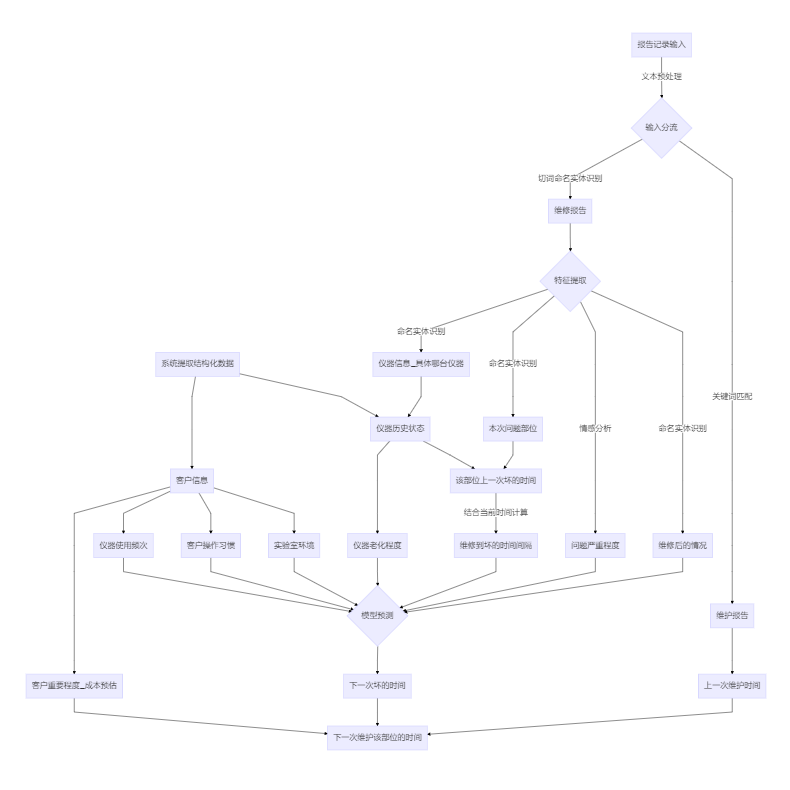

## Biosan维修部维护效率提升项目

### 项目目标

利用Biosan技术保障中心维修部的历史维修报告记录文本，提取出各种设备的历史故障数据（包括使用年限、维修服务内容、故障描述、故障模块、故障时间等，部分设备的实验数据（例如质谱仪等）），建立一套运维模式，预测仪器发生故障的风险，对风险较高的设备进行干预（重点巡检和维护）。

### 问题分析

需要回答的问题是，下次对某台仪器需要什么时候去维护

所以预测的主体，应该是仪器而不是客户

其次，存在一次维护修复多台仪器的可能，所以训练样本的条数并不是数据的行数，需要对所有数据进行拆分，对每条仪器的护理动作单独提出来才行

最简单的思路：

定义每一家客户，每一台仪器，每一个核心部件（模块）的目前情况[《1235模块关键词定义》](source/md/1235关键词按模块分类.md)

定义这一核心部件一般在多长时间会坏，预测下一次坏的时间

仪器维护的时间是所有核心部件的维护加权合。

根据这一分析思路，认为目前的数据需要提取的信息包括：

1. 每个客户分别有哪些仪器，每台仪器的装机时间和维修次数，维修的内容需要细分，每个部位分别经过了多少次维修，目前情况如何评价
2. 需要定义每一类型仪器在某个部位坏了之后的寿命，或者某个部位某次维修之后，下次报错可能需要的时间。这个时间的定义可以是实验批次即老师操作的次数，也有可能是样本量。如果是样本量，需要读取每个客户的单批次实验样本量和总年度样本量，就跟汽车的里程一样计算寿命。
3. 如何细分大问题和小问题，可能一句话里既包括大问题又包括小问题，问题的分类需要和工程师沟通。

存在的数据偏差：

1. 不同工程师的报告风格不同，这与对应带教师父的要求严格程度有关，比如质谱工程师的记录就要比其他人的记录要相对详细，可能会带入更多问题。
2. 2015年的部分数据存在明显的缺失，可能是系统导出的不完整，是否可以直接丢弃这部分样本，值得考究。

通过观察 **问题描述** 及 **服务报告**内容，可以看到：

1. 问题中存在定期维护的内容，存在修理一台仪器同时维护另一台仪器的情况，需要观察定期维护的内容和其他有什么区别。

   这部分信息在**服务部门**字段有提及一部分，但并不全

2. 问题描述的部分是解释这次维修服务去解决的问题，服务报告是具体解决问题的方法。

3. 部分问题描述被记录在服务报告里，考虑是否应该把这两列合并处理

4. 服务报告的末尾一般有本次服务的结论，是否修好，可以选择提取一部分然后做人工的修正得出维修结果

   在另一列**问题是否解决**含有一部分此类结论，但是存在大部分的缺失

5. 存在一列**故障描述**包含了部分问题描述的内容

有一个核心问题是，如何衡量这次维护所修复的问题大小

1. 可以参考维修总费用这一列，存在一部分的缺失但是大部分是0。如何定义高额维修费用之后仪器的状态也是一个关键点。并且存在一次维护对多台仪器维护的可能，在拆分样本的时候如何对这一数据进行拆分，也是关键所在

2. 根据工程师提供的问题定义划分

### 目标设定

如果将维修后的下一次维修时间作为预测目标：

```mermaid
graph TD
A0 --> E1[客户信息]
E1 --> E12[客户重要程度_成本预估]
E1 --> E11[仪器使用频次]
E1 --> E14[客户操作习惯]
E1 --> E15[实验室环境]
A0[系统提取结构化数据] --> D11[仪器历史状态]
A[报告记录输入] --> |文本预处理|C{输入分流}
C --> |切词命名实体识别|B2[维修报告]
B2 --> C2{特征提取}
C2 --> |命名实体识别|D1[仪器信息_具体哪台仪器]
D1 --> D11
C2 --> |命名实体识别|D2[本次问题部位]
C2 --> |情感分析|D3[问题严重程度]
C2 --> |命名实体识别|D4[维修后的情况]
D11 --> D10[仪器老化程度]
D11 --> D12[该部位上一次坏的时间]
D2 --> D12 
D12 --> |结合当前时间计算|D13[维修到坏的时间间隔]
D3 --> B3
D4 --> B3
D10 --> B3
E14 --> B3
E15 --> B3
B3{模型预测} --> D15[下一次坏的时间]
E12 --> D14[下一次维护该部位的时间]
D13 --> B3
E11 --> B3
C --> |关键词匹配|B1[维护报告]
B1 --> E13[上一次维护时间]
E13 --> D14
D15 --> D14
```

### 实现步骤

#### 数据预处理

1. [原始数据分析](source/md/数据预处理过程.md)
2. [代码实现过程](ipy/data_preprocess.ipynb)

#### 特征提取

1. [特征工程设计](source/md/特征工程设计.md)

